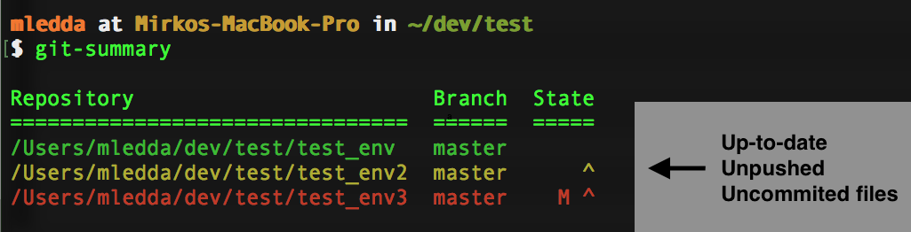

# git-summary
**If you ever experienced one of the following situations, git-summary is for you.**

* I don't remember where some of my repositories are...
* Did I forgot to push that commit?
* Do I have a repo in my system that is outdated?
* Did someone pushed new commits to `origin/master` in one of my repos?
* Did I commit that quick change I made before the pizza delivery guy rang my door?

git-summary is a bash script that will neatly list the current status of any git repos it founds within a  directory or your entire system. See the example screenshot below:



## Requirements
**Currently supported operating systems:** Linux, MacOS and Cygwin

### Linux
* `sudo apt-get install gawk`

### MacOS
* `brew install coreutils`

## Installation
### Via aliasing
Clone this repo and alias the script. To do so, add the following line to `~\.bashrc`:

```
alias git-summary='<PATH>/git-summary/git-summary'
```

> `<PATH>` is the path to the cloned repo. Don't worry, if you ever forget where you cloned this repo, you will be able to easily find it with `git-summary` :wink:

### Via executable lookup
Copy `git-summary` in `/usr/local/bin`.

## Usage
General usage:

```
git-summary [options] path
```

`path` is optional and the current directory will be used if left blank.

### Options
* **-h**: Print help and exit.
* **-l**: Local summary lookup. Checks only local changes which is faster as there is no need to fetch the remote.
* **-d**: Deep lookup. Look for any git repos within the entire current directory tree. Can be slowish for large trees.
* **-q**: Quiet mode. Only print outdated repos.
* **-s**: Sorted output. (Slower as it runs sequentially to avoid race conditions).

## Branch status
Currently, `git-summary` does not list multiple branches per repo. However, for single repos [`git-branch-status`](https://github.com/bill-auger/git-branch-status) does this beautifully.

## Credits
A big thanks :metal: to the amazing people that contributed to the original versions of `git-summary`:

* **Forked from** [lordadamson](https://github.com/lordadamson/git-summary)
* [mzabriskie](https://github.com/mzabriskie) (Posted the original idea [here](https://gist.github.com/mzabriskie/6631607))
* [CycleMost](https://github.com/CycleMost)
* [lmj0011](https://github.com/lmj0011)
* [gimbo](https://github.com/gimbo)
* [zartc](https://github.com/zartc)

Additional thanks go to:
* [ruricolist](https://github.com/ruricolist) - Cygwin support and quiet mode.
* [romainreignier](https://github.com/romainreignier) and [tobiasw1](https://github.com/tobiasw1) - Sorted output.
